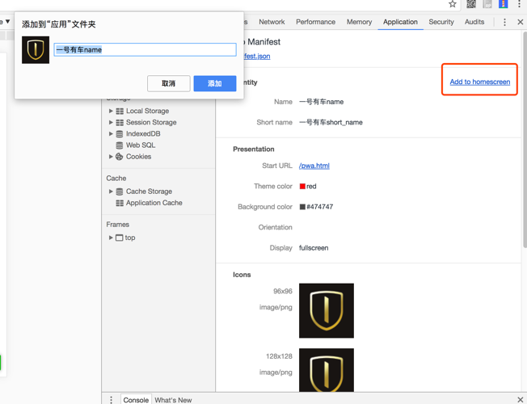
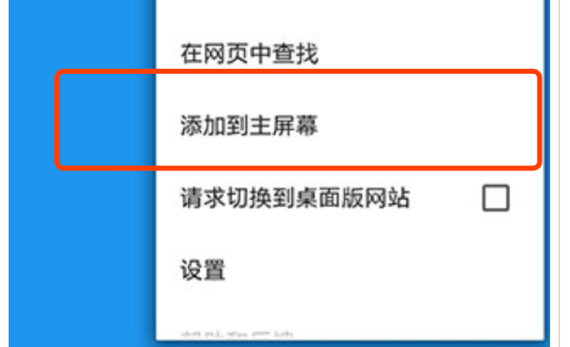
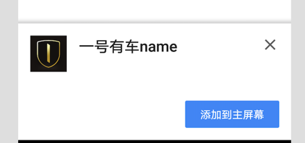

## 应用添加横幅
这篇文章简单介绍下如何应用添加横幅

### 创建manifest.json 文件


以下为manifest.json 的配置如下：

```markdown
{
  "name": "一号有车name",
  "short_name": "一号有车short_name",
  "start_url": "/",
  "display": "fullscreen",
  "background_color": "#474747",
  "theme_color":"red",
  "icons": [
    {
      "src": "./static/imgs/icons/96x96.png",
      "type": "image/png",
      "sizes": "96x96"
    },
    {
      "src": "./static/imgs/icons/96x96.png",
      "type": "image/png",
      "sizes": "128x128"
    },
    {
      "src": "./static/imgs/icons/144x144.png",
      "type": "image/png",
      "sizes": "144x144"
    },
    {
      "src": "./static/imgs/icons/188x188.png",
      "type": "image/png",
      "sizes": "188x188"
    }
  ]
}
```
以下为配置属性简介：
- short_name: 应用展示的名字（即添加到桌面的应用名字）
- icons: 定义不同尺寸的应用图标的数组
- start_url: 定义桌面启动的 URL
- description: 应用描述，可以参考 meta 中的 description
- display: 定义应用的显示方式，有 4 种显示方式，分别为：
- fullscreen: 全屏
- standalone: 应用
- minimal-ui: 类似于应用模式，但比应用模式多一些系统导航控制元素，但又不同于浏览器模式
- browser: 浏览器模式，默认值
- name: 应用名称(安装横幅显示的名字)
- orientation: 定义默认应用显示方向，竖屏、横屏
- prefer_related_applications: 是否设置对应移动应用，默认为 false
- related_applications: 获取移动应用的方式
- background_color: 应用加载之前的背景色，用于应用启动时的过渡
- theme_color: 定义应用默认的主题色
- dir: 文字方向，3 个值可选 ltr(left-to-right), rtl(right-to-left) 和 auto(浏览器判断)，默认为 auto
- lang: 语言
- scope: 定义应用模式下的路径范围，超出范围会已浏览器方式显示


### 安装横幅触发条件
拥有manifest文件，该文件具有：
- 一个 short_name
- 一个 name
- 一个 png 图标（图标声明必须包含一个 mime 类型的 image/png）
- 一个加载的 start_url
- 拥有一个在您的网站上注册的服务工作线程。
- 通过 HTTPS 提供（这是使用服务工作线程的一项要求。当然127本地的调试的也可以）。
- 被访问至少两次，这两次访问至少间隔五分钟。

### 支持的浏览器
目前支持的浏览器如下：
- chrome
- 手机百度
- 百度浏览器
- 小米(亲测，可以)
注意一点，虽然你点击了安装，也提示你安装成功，但是桌面上仍然看不到快捷方式，这个跟手机的系统权限有关，比如华为和小米，需要手动开启支持安装快捷方式的权限

- 查看浏览器支持权限：https://lavas.baidu.com/ready/feature
### 如何调试
工具：http-server，ngrok(自选)
- 首先你需要一个server，让你的项目run起来
- 因为Add to Homescreen 支持本地127的调试，所以http-server 足够了。
- 不过当你用LightHouse 分析的时候，会发现提示显示你没有https 提供，暂时先不用管，当然如果你需要本地启动https 的服务，可以装一个ngrok

用chrome 打开server 地址
打开控制台， 点击Application 栏
如红圈所标注。点击add to homescreen.即可触发安装横幅功能
只要弹出如下的弹框，即可认为添加横幅成功


### 取消或延迟安装横幅的触发事件
浏览器会根据上文中的触发横幅条件来计算弹框的时机，但是很多时候，我们需要更友好的交互，来控制弹框的时机.因此浏览器也提供了一些事件接口供网站开发者使用.

```
var dfdPrompt = null;
var button = document.getElementById('btn');
console.info('button',button)

window.addEventListener('beforeinstallprompt', function (e) {
  console.info('beforeinstallprompt');
  // 存储事件
  dfdPrompt = e;
  // 显示按钮
  button.style.display = 'block';
  // 阻止默认事件
  e.preventDefault();
  return false;
});

button.addEventListener('click', function (e) {
  console.info('dfdPrompt');
  console.info('dfdPrompt', dfdPrompt);
  if (dfdPrompt == null) {
    console.info('null');
    return;
  }
  // 通过按钮点击事件触发横幅显示
  dfdPrompt.prompt();
  console.info('prompt');
  // 用户的安装行为
  dfdPrompt.userChoice.then(function (choiceResult) {
    console.info(choiceResult.outcome);
  });
  // 隐藏按钮
  //button.style.display = 'none';
  //dfdPrompt = null;
});

```
### TIPS:
- dfdPrompt.prompt(); 只会触发一次。所以，如果你拒绝安装横幅。将不再能弹出添加提示
- 目前暂时没有事件（或者我没有找到）可以强制让浏览器自动弹出横幅（但pc版可以点击上图的Add to homescreen 强行唤起添加横幅功能），
- 自动弹出时机仍然是上面的条件。但是也不代表满足条件就一定会自动触发，具体还是根据浏览器的算法，除非你手动点击浏览器的添加到主屏幕的功能



最终具体效果图如下

-   
